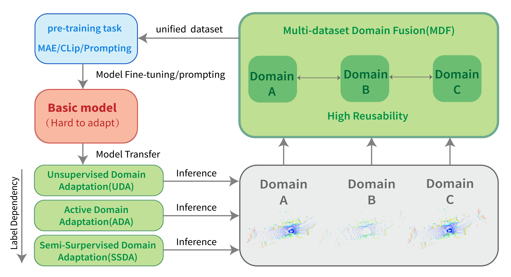
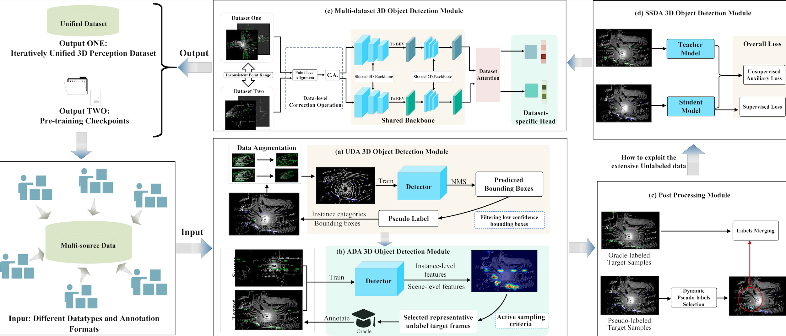

## 3DTrans Framework Introduction

### What does `3DTrans` Codebase do?

- **Rapid Target-domain Adaptation**: `3DTrans` can boost the 3D perception model's adaptability for an unseen domain only using unlabeled data. For example, [ST3D](https://arxiv.org/abs/2103.05346) supported by `3DTrans` repository achieves a new state-of-the-art model transfer performance for many adaptation tasks, further boosting the transferability of detection models. Besides, `3DTrans` develops many new UDA techniques to solve different types of domain shifts (such as LiDAR-induced shifts or object-size-induced shifts), which includes Pre-SN, Post-SN, and range-map downsampling retraining.

- **Annotation-saving Target-domain Transfer**: `3DTrans` can select the most informative subset of an unseen domain and label them at a minimum cost. For example, `3DTrans` develops the [Bi3D](https://arxiv.org/abs/2303.05886), which selects partial-yet-important target data and labels them at a minimum cost, to achieve a good trade-off between high performance and low annotation cost. Besides, `3DTrans` has integrated several typical transfer learning techniques into the 3D object detection pipeline. For example, we integrate the [TQS](https://openaccess.thecvf.com/content/CVPR2021/papers/Fu_Transferable_Query_Selection_for_Active_Domain_Adaptation_CVPR_2021_paper.pdf), [CLUE](https://arxiv.org/abs/2010.08666), [SN](https://arxiv.org/abs/2005.08139), [ST3D](https://arxiv.org/abs/2103.05346), [Pseudo-labeling](https://arxiv.org/abs/2103.05346), [SESS](https://arxiv.org/abs/1912.11803), and [Mean-Teacher](https://arxiv.org/abs/1703.01780) for supporting autonomous driving-related model transfer.

- **Joint Training on Multiple 3D Datasets**: `3DTrans` can perform the multi-dataset 3D object detection task. For example, `3DTrans` develops the [Uni3D](https://arxiv.org/abs/2303.06880) for multi-dataset 3D object detection, which enables the current 3D baseline models to effectively learn from multiple off-the-shelf 3D datasets, boosting the reusability of 3D data from different autonomous driving manufacturers.

- **Multi-dataset Support**: `3DTrans` provides a unified interface of dataloader, data augmentor, and data processor for multiple public benchmarks, including Waymo, nuScenes, ONCE, Lyft, and KITTI, etc, which is beneficial to study the transferability and generality of 3D perception models among different datasets. Besides, in order to eliminate the domain gaps between different manufacturers and obtain generalizable representations, `3DTrans` has integrated typical unlabeled pre-training techniques for giving a better parameter initialization of the current 3D baseline models. For example, we integrate the [PointContrast](https://arxiv.org/abs/2007.10985) and [SESS](https://arxiv.org/abs/1912.11803) to support point cloud-based pre-training task.

- **Extensibility for Multiple Models**: `3DTrans` makes the baseline model have the ability of cross-domain/dataset safe transfer and multi-dataset joint training. Without making major changes of the code and 3D model structure, a single-dataset 3D baseline model can be successfully adapted to an unseen domain or dataset by using our `3DTrans`.

- `3DTrans` is developed based on [`OpenPCDet`](https://github.com/open-mmlab/OpenPCDet) codebase, which can be easily integrated with the models developing using `OpenPCDet` repository. Thanks for their valuable open-sourcing!

&ensp;

  
  
The relations of different modules (UDA, ADA, SSDA, MDF, Pre-training) in 3DTrans: The basic model uses UDA/ADA/SSDA (target-oriented adaptation techniques to alleviate inter-domain shift and perform the inference). Then, MDF can use the results of multi-source domains for pre-training to generate a unified dataset. Finally, pre-training task are utilized to learn generalizable representations from multi-source domains, which can effectively boost the performance of basic model.

### Multi-source Pre-training Framework Visualization
&ensp;

  
  
The detailed network structure information of each module in 3DTrans, where we leverage multi-source domains with significant data-level differences to perform the point-cloud pre-training task.

