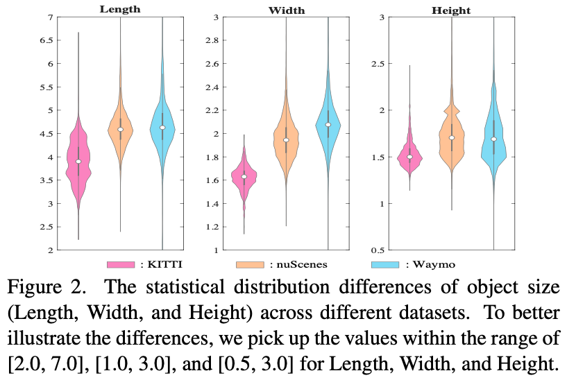

# Getting Started & Problem Definition

The purpose of Multi-Domain Fusion (MDF) is to train a unified model from multiple labeled domains $s_i$, to obtain more generalizable representations $F$, which would have minimum prediction error on the multiple different domains $s_i$.

&ensp;
# Getting Started & Task Challenges
1) **Data-level differences**: Compared with 2D natural images that are composed of pixels with a consistent value range of [0, 255], 3D point clouds often are collected using different sensor types with different point cloud ranges and object-size distribution, which lead to distributional discrepancy among datasets.
    <p align="center">
    
    </p>
2) **Taxonomy-level differences**: Different autonomous driving manufacturers employ inconsistent class definitions and annotation granularity.


&ensp;
&ensp;
# Getting Started & Training-Testing for MDF Setting

Here, we take Waymo-and-nuScenes consolidation as an example.

## Joint-training stage: train a baseline detection model on the merged dataset: 
* Train with consistent point-cloud range (employing Waymo range) using multiple GPUs
* Note that the multi-dataset 3D detection results will become very poor, if the point-cloud-range for different datasets is not aligned.
```shell script
sh scripts/MDF/dist_train_multi_db_merge_loss.sh ${NUM_GPUs} \
--cfg_file ./cfgs/MDF/waymo_nusc/multi_db_pvrcnn_feat_3_merged.yaml
```

* Train with consistent point-cloud range (employing Waymo range) using multiple machines
```shell script
sh scripts/MDF/slurm_train_multi_db_merge_loss.sh ${PARTITION} ${JOB_NAME} ${NUM_NODES} \
--cfg_file ./cfgs/MDF/waymo_nusc/multi_db_pvrcnn_feat_3_merged.yaml
```

* Train other baseline detectors such as PV-RCNN++ using multiple GPUs
```shell script
sh scripts/MDF/dist_train_multi_db_merge_loss.sh ${NUM_GPUs} \
--cfg_file ./cfgs/MDF/waymo_nusc/multi_db_pvplus_feat_3_merged.yaml
```

* Train other baseline detectors such as Voxel-RCNN using multiple GPUs
```shell script
sh scripts/MDF/dist_train_multi_db_merge_loss.sh ${NUM_GPUs} \
--cfg_file ./cfgs/MDF/waymo_nusc/multi_db_voxel_rcnn_feat_3_merged.yaml
```

## Joint-training stage: train a Uni3D detection model on the merged dataset: 

* Train with consistent point-cloud range (employing Waymo range) and C.A. (Coordinate-origin Alignment) using multiple GPUs
```shell script
sh scripts/MDF/dist_train_mdf.sh ${NUM_GPUs} \
--cfg_file ./cfgs/MDF/waymo_nusc/waymo_nusc_pvrcnn_feat_3_uni3d.yaml \
--source_one_name waymo
```

* Train with consistent point-cloud range (employing Waymo range) and C.A. (Coordinate-origin Alignment) using multiple machines
```shell script
sh scripts/MDF/slurm_train_multi_db.sh ${PARTITION} ${JOB_NAME} ${NUM_NODES} \
--cfg_file ./cfgs/MDF/waymo_nusc/waymo_nusc_pvrcnn_feat_3_uni3d.yaml \
--source_one_name waymo
```

* Train other baseline detectors such as PV-RCNN++ using multiple GPUs
```shell script
sh scripts/MDF/dist_train_mdf.sh ${NUM_GPUs} \
--cfg_file ./cfgs/MDF/waymo_nusc/waymo_nusc_pvplus_feat_3_uni3d.yaml \
--source_one_name waymo
```

* Train other baseline detectors such as Voxel-RCNN using multiple GPUs
```shell script
sh scripts/MDF/dist_train_mdf.sh ${NUM_GPUs} \
--cfg_file ./cfgs/MDF/waymo_nusc/waymo_nusc_voxel_rcnn_feat_3_uni3d.yaml \
--source_one_name waymo
```

&ensp;
## :fire: News :fire:
## A simpler way to achieve the feature coupling and reuse for MDF setting: 
* Train with Domain Attention (DT) using multiple GPUs
```shell script
sh scripts/MDF/dist_train_mdf.sh ${NUM_GPUs} \
--cfg_file ./cfgs/MDF/waymo_nusc/waymo_nusc_pvrcnn_feat_3_domain_attention.yaml \
--source_one_name waymo
```

* Train with Domain Attention (DT) using multiple machines
```shell script
sh scripts/MDF/slurm_train_multi_db.sh ${PARTITION} ${JOB_NAME} ${NUM_NODES} \
--cfg_file ./cfgs/MDF/waymo_nusc/waymo_nusc_pvrcnn_feat_3_domain_attention.yaml \
--source_one_name waymo
```

* Train other baseline detectors such as PV-RCNN++ using multiple GPUs
```shell script
sh scripts/MDF/dist_train_mdf.sh ${NUM_GPUs} \
--cfg_file ./cfgs/MDF/waymo_nusc/waymo_nusc_pvplus_feat_3_domain_attention.yaml \
--source_one_name waymo
```

* Train other baseline detectors such as Voxel-RCNN using multiple GPUs
```shell script
sh scripts/MDF/dist_train_mdf.sh ${NUM_GPUs} \
--cfg_file ./cfgs/MDF/waymo_nusc/waymo_nusc_voxel_rcnn_feat_3_domain_attention.yaml \
--source_one_name waymo
```

## Training using another Backbone:
* Train using multiple GPUs
```shell script
sh scripts/MDF/dist_train_mdf.sh ${NUM_GPUs} \
--cfg_file ./cfgs/MDF/waymo_nusc/waymo_nusc_voxel_rcnn_resnet_feat_3_domain_attention.yaml \
--source_one_name waymo
```

* Train multiple machines
```shell script
sh scripts/MDF/slurm_train_multi_db.sh ${PARTITION} ${JOB_NAME} ${NUM_NODES} \
--cfg_file ./cfgs/MDF/waymo_nusc/waymo_nusc_voxel_rcnn_resnet_feat_3_domain_attention.yaml \
--source_one_name waymo
```

&ensp;
## Evaluation stage: evaluate the unified detection model on different datasets:
* Note that for the KITTI-related evaluation, please try --set DATA_CONFIG.FOV_POINTS_ONLY True to enable front view point cloud only. We report the best results on KITTI for testing all epochs on the validation set.

    - ${FIRST_DB_NAME} denotes that the fisrt dataset name of the merged two dataset, which is used to split the merged dataset into two individual datasets.

    - ${DB_SOURCE} denotes the dataset to be tested.


* Test the models using multiple GPUs
```shell script
sh scripts/MDF/dist_test_mdf.sh ${NUM_GPUs} \
--cfg_file ${CFG_FILE} \
--ckpt ${CKPT} \
--source_one_name ${FIRST_DB_NAME} \
--source_1 ${DB_SOURCE} 
```

* Test the models using multiple machines
```shell script
sh scripts/MDF/slurm_test_mdb_mgpu.sh ${PARTITION} ${JOB_NAME} ${NUM_NODES} \
--cfg_file ${CFG_FILE} \
--ckpt ${CKPT} \
--source_one_name ${FIRST_DB_NAME} \
--source_1 ${DB_SOURCE} 
```


&ensp;
# All MDF Results:
Here, we report the Waymo-and-nuScenes consolidation results, and the model is evaluated on Waymo using the mAP/mAPH LEVEL_2 and nuScenes using the BEV/3D AP.
* All LiDAR-based models are trained with 8 NVIDIA A100 GPUs and are available for download. 
* The multi-domain dataset fusion (MDF) training time is measured with 8 NVIDIA A100 GPUs and PyTorch 1.8.1.
* For Waymo dataset training, we train the model using 20% training data for saving training time.
* PV-RCNN-nuScenes represents that we train the PV-RCNN model only using nuScenes dataset, and PV-RCNN-DM indicates that we merge the Waymo and nuScenes datasets and train on the merged dataset. Besides, PV-RCNN-DT denotes the domain attention-aware multi-dataset training.

|                Baseline       |          MDF Methods              | Waymo@Vehicle | Waymo@Pedestrian | Waymo@Cyclist   |  nuScenes@Car | nuScenes@Pedestrian | nuScenes@Cyclist   | 
|--------------------------|---------------------------:|:------------------:|:-------------:|:------------:|:------------:|:-------------:|:----------------:|
| [PV-RCNN-nuScenes](../tools/cfgs/MDF/waymo_nusc/only_nusc/pvrcnn_feat_3_SWEEP_10_gt.yaml) | only nuScenes | 35.59 / 35.21 | 3.95 / 2.55 | 0.94 / 0.92 | 57.78 / 41.10 | 24.52 / 18.56 | 10.24 / 8.25  |
| [PV-RCNN-Waymo](../tools/cfgs/MDF/waymo_nusc/only_waymo/pvrcnn_feat_3_3CLS_gt.yaml) | only Waymo | 66.49 / 66.01 | 64.09 / 58.06 | 62.09 / 61.02 | 32.99 / 17.55 | 3.34 / 1.94 |  0.02 / 0.01  |
| [PV-RCNN-DM](../tools/cfgs/MDF/waymo_nusc/multi_db_pvrcnn_feat_3_merged.yaml) | Direct Merging | 57.82 / 57.40 | 48.24 / 42.81 |  54.63 / 53.64  |  48.67 / 30.43 |  12.66 / 8.12 | 1.67 / 1.04 |
| [PV-RCNN-Uni3D](../tools/cfgs/MDF/waymo_nusc/waymo_nusc_pvrcnn_feat_3_uni3d.yaml) | Uni3D | 66.98 / 66.50 | 65.70 / 59.14 | 61.49 / 60.43 | 60.77 / 42.66|  27.44 / 21.85 | 13.50 / 11.87  |
| [PV-RCNN-DT](../tools/cfgs/MDF/waymo_nusc/waymo_nusc_pvrcnn_feat_3_domain_attention.yaml) | Domain Attention | 67.27 / 66.77 | 65.86 / 59.38  |  61.38 / 60.34  | 60.83 / 43.03   |   27.46 / 22.06  |   13.82 / 11.52  |


|                Baseline       |          MDF Methods              | Waymo@Vehicle | Waymo@Pedestrian | Waymo@Cyclist   |  nuScenes@Car | nuScenes@Pedestrian | nuScenes@Cyclist   | 
|------------------------------|-----------:|:---------:|:-------:|:-------:|:----------:|:-------:|:---------:|
| [Voxel-RCNN-nuScenes](../tools/cfgs/MDF/waymo_nusc/only_nusc/voxel_rcnn_feat_3_SWEEP_10_gt.yaml) | only nuScenes | 31.89 / 31.65  | 3.74 / 2.57 |2.41 / 2.37 | 53.63 / 39.05 | 22.48 / 17.85 | 10.86 / 9.70  |
| [Voxel-RCNN-Waymo](../tools/cfgs/MDF/waymo_nusc/only_waymo/voxel_rcnn_feat_3_3CLS_gt.yaml) |  only Waymo | 67.05 / 66.41  | 66.75 / 60.83 | 63.13 / 62.15 | 34.10 / 17.31| 2.99 / 1.69  |  0.05 / 0.01   |
| [Voxel-RCNN-DM](../tools/cfgs/MDF/waymo_nusc/multi_db_voxel_rcnn_feat_3_merged.yaml) | Direct Merging | 58.26 / 57.87 |  52.72 / 47.11   |  50.26 / 49.50  |  51.40 / 31.68   |  15.04 / 9.99  |  5.40 / 3.87  |
| [Voxel-RCNN-Uni3D](../tools/cfgs/MDF/waymo_nusc/waymo_nusc_voxel_rcnn_feat_3_uni3d.yaml) | Uni3D | 66.76 / 66.29  |  66.62 / 60.51  |  63.36 / 62.42  |  60.18 / 42.23 | 30.08 / 24.37   |  14.60 / 12.32  |
| [Voxel-RCNN-DT](../tools/cfgs/MDF/waymo_nusc/waymo_nusc_voxel_rcnn_feat_3_domain_attention.yaml) | Domain Attention | 66.96 / 66.50 |  68.23 / 62.00  |  62.57 / 61.64   | 60.42 / 42.81  |  30.49 / 24.92  |  15.91 / 13.35  |


|                Baseline       |          MDF Methods              | Waymo@Vehicle | Waymo@Pedestrian | Waymo@Cyclist   |  nuScenes@Car | nuScenes@Pedestrian | nuScenes@Cyclist   | 
|------------------------------|-----------:|:---------:|:-------:|:-------:|:----------:|:-------:|:---------:|
| [PV-RCNN++ DM](../tools/cfgs/MDF/waymo_nusc/multi_db_pvplus_feat_3_merged.yaml) | Direct Merging | 63.79 / 63.38  |  55.03 / 49.75  |  59.88 / 58.99  |  50.91 / 31.46  |   17.07 / 12.15   |   3.10 / 2.20   |
| [PV-RCNN++-Uni3D](../tools/cfgs/MDF/waymo_nusc/waymo_nusc_pvplus_feat_3_uni3d.yaml) | Uni3D | 68.55 / 68.08  |  69.83 / 63.60 |  64.90 / 63.91   | 62.51 / 44.16 |  33.82 / 27.18  |  22.48 / 19.30    |
| [PV-RCNN++-DT](../tools/cfgs/MDF/waymo_nusc/waymo_nusc_pvplus_feat_3_domain_attention.yaml) | Domain Attention | 68.51 / 68.05 |  69.81 / 63.58  |  64.39 / 63.43  | 62.33 / 44.16  |  33.44 / 26.94 | 21.64 / 18.52  |


&ensp;
&ensp;
## Joint-training using Waymo, KITTI, and nuScenes:
* Train with consistent point-cloud range (employing Waymo range) using multiple GPUs
```shell script
sh scripts/MDF/dist_train_mdf_3db.sh ${NUM_GPUs} \
--cfg_file ./cfgs/MDF/KNW/knw_voxel_rcnn_feat_3_uni3d.yaml
```

* Train with consistent point-cloud range (employing Waymo range) using multiple machines
```shell script
sh scripts/MDF/slurm_train_multi_db_3db.sh ${PARTITION} ${JOB_NAME} ${NUM_NODES} \
--cfg_file ./cfgs/MDF/KNW/knw_voxel_rcnn_feat_3_uni3d.yaml
```

* Train other baseline detectors such as PV-RCNN using multiple GPUs
```shell script
sh scripts/MDF/dist_train_mdf_3db.sh ${NUM_GPUs} \
--cfg_file ./cfgs/MDF/KNW/knw_pvrcnn_feat_3_uni3d.yaml
```

## Evaluation stage: evaluate the unified detection model on different datasets:
* ${DB_SOURCE} denotes the dataset to be tested.


* Test the models using multiple GPUs
```shell script
sh scripts/MDF/dist_test_mdf_3db.sh ${NUM_GPUs} \
--cfg_file ${CFG_FILE} \
--ckpt ${CKPT} \
--source_1 ${DB_SOURCE} 
```

* Test the models using multiple machines
```shell script
sh scripts/MDF/slurm_test_mdb_mgpu_3db.sh ${PARTITION} ${JOB_NAME} ${NUM_NODES} \
--cfg_file ${CFG_FILE} \
--ckpt ${CKPT} \
--source_1 ${DB_SOURCE} 
```