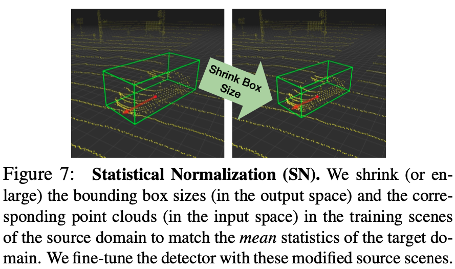

# Getting Started & Problem Definition

The purpose of an Unsupervised Domain Adaptation (UDA) task is to learn a generalized model or backbone $F$ on a labeled source domain $s$ and an unlabeled target domain $t$, such that the $F$ can be adapted to the new target domain $t$, where unlabeled training data (such as point cloud or images) from the target domain $t$ are assumed to be available during the adaptation process.

&ensp;
# Getting Started & Task Challenges
- Different domains present inconsistent object-size distribution, as illustrated in [file of object-size statistics](STATISTICAL_RESULTS.md). Thus, Statistical Normalization (SN) is used to rescale the object-size during the source-domain training process, where both the bounding box size and point cloud within this bounding box are rescaled. For Waymo-to-KITTI adaptation, we found that the object-size variation is a major reason of cross-domain detection accuracy drop.
    <p align="center">
    
    </p>

- LiDAR beam is also constantly changing for different AD manufacturers. For waymo-to-nuScenes adaptation, we argue that the LiDAR-beam variation is a major challenge, and leverage the range-map provided by Waymo tfrecords to produce the low-beam point clouds (such as 32-beam or 16-beam). Please refer to [Results](#uda-results-for-waymo-to-nuscenes) for more details.
    - For some dataset where the range-map is not provided, such as ONCE dataset, one can employ the clustering algorithm on height-angles to obtain the pseudo-labeled low-beam point clouds, which is also verified to be effective in our codebase.

&ensp;
&ensp;
# Getting Started & Training-Testing for UDA Setting

Here, we take Waymo-to-KITTI adaptation as an example.

## Pretraining stage: train the source-only model on the labeled source domain: 

* Train FEAT=3 (X,Y,Z) with SN (statistical normalization) using multiple GPUs
```shell script
sh scripts/dist_train.sh ${NUM_GPUs} \
--cfg_file ./cfgs/DA/waymo_kitti/source_only/pvrcnn_old_anchor_sn_kitti.yaml
```

* Train FEAT=3 (X,Y,Z) with SN (statistical normalization) using multiple machines
```shell script
sh scripts/slurm_train.sh ${PARTITION} ${JOB_NAME} ${NUM_NODES} \
--cfg_file ./cfgs/DA/waymo_kitti/source_only/pvrcnn_old_anchor_sn_kitti.yaml
```

* Train FEAT=3 (X,Y,Z) without SN (statistical normalization) using multiple GPUs
```shell script
sh scripts/dist_train.sh ${NUM_GPUs} \
--cfg_file ./cfgs/DA/waymo_kitti/source_only/pvrcnn_feat_3_vehi.yaml
```

* Train FEAT=3 (X,Y,Z) without SN (statistical normalization) using multiple machines
```shell script
sh scripts/slurm_train.sh ${PARTITION} ${JOB_NAME} ${NUM_NODES} \
--cfg_file ./cfgs/DA/waymo_kitti/source_only/pvrcnn_feat_3_vehi.yaml
```

* Train other baseline detectors such as PV-RCNN++ using multiple GPUs
```shell script
sh scripts/dist_train.sh ${NUM_GPUs} \
--cfg_file ./cfgs/DA/waymo_kitti/source_only/pv_rcnn_plus_feat_3_vehi_full_train.yaml
```

* Train other baseline detectors such as Voxel-RCNN using multiple GPUs
```shell script
sh scripts/dist_train.sh ${NUM_GPUs} \
--cfg_file ./cfgs/DA/waymo_kitti/source_only/voxel_rcnn_feat_3_vehi.yaml
```

## Evaluate the source-pretrained model:
* Note that for the cross-domain setting where the KITTI dataset is regarded as the target domain, please try --set DATA_CONFIG_TAR.FOV_POINTS_ONLY True to enable front view point cloud only. We report the best model for all epochs on the validation set.

* Test the source-only models using multiple GPUs
```shell script
sh scripts/dist_test.sh ${NUM_GPUs} \
--cfg_file ./cfgs/DA/waymo_kitti/source_only/pvrcnn_feat_3_vehi.yaml \
--ckpt ${CKPT} 
```

* Test the source-only models using multiple machines
```shell script
sh scripts/slurm_test_mgpu.sh ${PARTITION} ${NUM_NODES} \
--cfg_file ./cfgs/DA/waymo_kitti/source_only/pvrcnn_feat_3_vehi.yaml \
--ckpt ${CKPT}
```

* Test the source-only models of all ckpts using multiple GPUs
```shell script
sh scripts/dist_test.sh ${NUM_GPUs} \
--cfg_file ./cfgs/DA/waymo_kitti/source_only/pvrcnn_feat_3_vehi.yaml \
--eval_all
```

* Test the source-only models of all ckpts using multiple machines
```shell script
sh scripts/slurm_test_mgpu.sh ${PARTITION} ${NUM_NODES} \
--cfg_file ./cfgs/DA/waymo_kitti/source_only/pvrcnn_feat_3_vehi.yaml \
--eval_all
```

## Adaptation stage: self-training the source-model on the unlabeled target domain:
* You need to set the `--pretrained_model ${PRETRAINED_MODEL}` when finish the above pretraining model stage.
* If you train the source-only model using the SN (statistical normalization). For example, you train the model with  pvrcnn_old_anchor_sn_kitti.yaml, you should perform the pre-SN script as follows, where pre-SN represents that we perform the SN (statistical normalization) operation before the adaptation stage.

* Train FEAT=3 (X,Y,Z) with pre-SN (statistical normalization) using multiple machines
```shell script
sh scripts/UDA/slurm_train_uda.sh ${PARTITION} ${JOB_NAME} ${NUM_NODES} ${QUOTATYPE} \
--cfg_file ./cfgs/DA/waymo_kitti/pvrcnn_pre_SN_feat_3.yaml \
--pretrained_model ${PRETRAINED_MODEL}
```

* Train FEAT=3 (X,Y,Z) with pre-SN (statistical normalization) using multiple GPUs
```shell script
sh scripts/UDA/dist_train_uda.sh ${NUM_GPUs} \
--cfg_file ./cfgs/DA/waymo_kitti/pvrcnn_pre_SN_feat_3.yaml \
--pretrained_model ${PRETRAINED_MODEL}
```

* If you train the source-only model without using the SN (statistical normalization), you should perform the post-SN script as follows, where post-SN represents that we perform the SN (statistical normalization) operation during the adaptation stage.

* Train FEAT=3 (X,Y,Z) with post-SN (statistical normalization) using multiple machines
```shell script
sh scripts/UDA/slurm_train_uda.sh ${PARTITION} ${JOB_NAME} ${NUM_NODES} ${QUOTATYPE} \
--cfg_file ./cfgs/DA/waymo_kitti/pvrcnn_post_SN_feat_3.yaml \
--pretrained_model ${PRETRAINED_MODEL}
```

* Train FEAT=3 (X,Y,Z) with post-SN (statistical normalization) using multiple GPUs
```shell script
sh scripts/UDA/dist_train_uda.sh ${NUM_GPUs} \
--cfg_file ./cfgs/DA/waymo_kitti/pvrcnn_post_SN_feat_3.yaml \
--pretrained_model ${PRETRAINED_MODEL}
```

## Evaluating the model on the target validation set:
* Note that for the cross-domain setting where the KITTI dataset is regarded as the target domain, please try --set DATA_CONFIG_TAR.FOV_POINTS_ONLY True to enable front view point cloud only. We report the best model for all epochs on the validation set.

* Test with a ckpt file: 
```shell script
python test.py \
--cfg_file ${CONFIG_FILE} \
--batch_size ${BATCH_SIZE} \
--ckpt ${CKPT}
```

* To test all the saved checkpoints of a specific training setting and draw the performance curve on the Tensorboard, add the `--eval_all` argument: 
```shell script
python test.py \
--cfg_file ${CONFIG_FILE} \
--batch_size ${BATCH_SIZE} \
--eval_all
```

* To test with multiple GPUs:
```shell script
sh scripts/dist_test.sh ${NUM_GPUs} \ 
--cfg_file ${CONFIG_FILE} \
--batch_size ${BATCH_SIZE} \
--ckpt ${CKPT}
```

* To test all ckpts with multiple GPUs
```shell script
sh scripts/dist_test.sh ${NUM_GPUs} \
--cfg_file ${CONFIG_FILE} \
--batch_size ${BATCH_SIZE} \
--eval_all
```

* To test with multiple machines:
```shell script
sh scripts/slurm_test_mgpu.sh ${PARTITION} ${NUM_NODES} \ 
    --cfg_file ${CONFIG_FILE} --batch_size ${BATCH_SIZE} --ckpt ${CKPT}
```

* To test all ckpts with multiple machines:
```shell script
sh scripts/slurm_test_mgpu.sh ${PARTITION} ${NUM_NODES} \ 
    --cfg_file ${CONFIG_FILE} --batch_size ${BATCH_SIZE} --eval_all
```

&ensp;
&ensp;
# All UDA Results:
We report the cross-dataset adaptation results including Waymo-to-KITTI, nuScenes-to-KITTI, and Waymo-to-nuScenes.
* All LiDAR-based models are trained with 4 NVIDIA A100 GPUs and are available for download. 
* The domain adaptation time is measured with 4 NVIDIA A100 GPUs and PyTorch 1.8.1.
* All results are reported using the BEV/3D AP performance as the evaluation metric. We report the moderate case for KITTI dataset.
* Pre-SN represents that we perform the SN (statistical normalization) operation during the pre-training stage (SN for source domain).
* Post-SN represents that we perform the SN (statistical normalization) operation during the adaptation stage (SN for target domain).

## UDA Results for Waymo-to-KITTI:

|                                             | training time | Adaptation | Car@R40   | download | 
|---------------------------------------------|----------:|:-------:|:-------:|:---------:|
| [PointPillar](../tools/cfgs/DA/waymo_kitti/source_only/pointpillar_1x_feat_3_vehi.yaml) |~7.1 hours| Source-only with SN | 74.98 / 49.31 | - | 
| [PointPillar](../tools/cfgs/DA/waymo_kitti/pointpillar_1x_pre_SN_feat_3.yaml) |~0.6 hours| Pre-SN | 81.71 / 57.11 | [model-57M](https://drive.google.com/file/d/1tPx8N75sm_zWsZv3FrwtHXeBlorhf9nP/view?usp=share_link) | 
| [PV-RCNN](../tools/cfgs/DA/waymo_kitti/source_only/pvrcnn_old_anchor_sn_kitti.yaml) | ~23 hours| Source-only with SN | 69.92 / 60.17 | - |
| [PV-RCNN](../tools/cfgs/DA/waymo_kitti/source_only/pvrcnn_feat_3_vehi.yaml) | ~23 hours| Source-only | 74.42 / 40.35 | - |
| [PV-RCNN](../tools/cfgs/DA/waymo_kitti/pvrcnn_pre_SN_feat_3.yaml) | ~3.5 hours| Pre-SN | 84.00 / 74.57 | [model-156M](https://drive.google.com/file/d/1yt1JtBWyBtZjgE22HJUz6L7K6qeWiqM5/view?usp=share_link) |
| [PV-RCNN](../tools/cfgs/DA/waymo_kitti/pvrcnn_post_SN_feat_3.yaml) | ~1 hours| Post-SN | 84.94 / 75.20 | [model-156M](https://drive.google.com/file/d/1hd49JZ5amwP2gkblA8IHnH79ITapX2hF/view?usp=share_link) |
| [Voxel R-CNN](../tools/cfgs/DA/waymo_kitti/source_only/voxel_rcnn_sn_kitti.yaml) | ~16 hours| Source-only with SN | 75.83 / 55.50 | - |
| [Voxel R-CNN](../tools/cfgs/DA/waymo_kitti/source_only/voxel_rcnn_feat_3_vehi.yaml) | ~16 hours| Source-only | 64.88 / 19.90 | - |
| [Voxel R-CNN](../tools/cfgs/DA/waymo_kitti/voxel_rcnn_pre_SN_feat_3.yaml) | ~2.5 hours| Pre-SN | 82.56 / 67.32 | [model-201M](https://drive.google.com/file/d/1_D7bnECL7bHL_4WOPhxAprHHmxwC8M7U/view?usp=share_link) |
| [Voxel R-CNN](../tools/cfgs/DA/waymo_kitti/voxel_rcnn_post_SN_feat_3.yaml) | ~2.2 hours| Post-SN | 85.44 / 76.78 | [model-201M](https://drive.google.com/file/d/1v0U3Y9K6pe4JaOC5PIECq_wnR77Il-tl/view?usp=share_link) |
| [PV-RCNN++](../tools/cfgs/DA/waymo_kitti/source_only/pv_rcnn_plus_sn_kitti.yaml) | ~20 hours| Source-only with SN | 67.22 / 56.50 | - |
| [PV-RCNN++](../tools/cfgs/DA/waymo_kitti/source_only/pv_rcnn_plus_feat_3_vehi_full_train.yaml) | ~20 hours| Source-only | 67.68 / 20.82 | - |
| [PV-RCNN++](../tools/cfgs/DA/waymo_kitti/pv_rcnn_plus_post_SN_feat_3.yaml) | ~2.2 hours| Post-SN | 86.86 / 79.86 | [model-193M](https://drive.google.com/file/d/1wDNC5kyg8BihV4zEgY2VntA2V_3jeL-5/view?usp=share_link) |


## UDA Results for nuScenes-to-KITTI:
|                                             | training time | Adaptation | Car@R40   | download | 
|---------------------------------------------|----------:|:-------:|:-------:|:---------:|
| [PV-RCNN](../tools/cfgs/DA/nusc_kitti/source_only/pvrcnn_old_anchor_sn_kitti.yaml) | ~15.7 hours| Source-only with SN | 60.16 / 49.63 | [model-156M](https://drive.google.com/file/d/1nYIWRfKbh9L1SIG9FDM39C_bZ1nAHsYh/view?usp=share_link) |
| [PV-RCNN](../tools/cfgs/DA/nusc_kitti/source_only/pvrcnn_old_anchor.yaml) | ~15.7 hours| Source-only | 64.58 / 27.12 | [model-156M](https://drive.google.com/file/d/1rn5c9XLVuF0OVHrZaBcDDZR5v7-MvwY8/view?usp=share_link) |
| [PV-RCNN](../tools/cfgs/DA/nusc_kitti/pvrcnn_pre_SN_feat_3.yaml) | ~1.5 hours| Pre-SN | 86.07 / 74.72 | [model-156M](https://drive.google.com/file/d/1sieE3FSiU8L34e8qbK0zd9IuPaMIDMHy/view?usp=share_link) |
| [PV-RCNN](../tools/cfgs/DA/nusc_kitti/pvrcnn_post_SN_feat_3.yaml) | ~1 hours| Post-SN | 88.79 / 72.50 | [model-156M](https://drive.google.com/file/d/1_XCadhCnGSZPfOoGX8XSe08tw6_TnNNW/view?usp=share_link) |
| [Voxel R-CNN](../tools/cfgs/DA/nusc_kitti/source_only/voxel_rcnn_feat_3_vehi.yaml) | ~8.5 hours| Source-only | 66.94 / 30.33 | [model-201M](https://drive.google.com/file/d/1JAsvlJrXcSu1VYrmgjwKIIPHv0BPb_Xw/view?usp=share_link) |
| [Voxel R-CNN](../tools/cfgs/DA/waymo_kitti/voxel_rcnn_post_SN_feat_3.yaml) | ~2.2 hours| Post-SN | 87.11 / 66.02 | [model-201M](https://drive.google.com/file/d/1mrwM1P9TxBZtVZFXLB3_-g23Kvh7H73S/view?usp=share_link) |
| [PV-RCNN++](../tools/cfgs/DA/nusc_kitti/source_only/pv_rcnn_plus_sn_kitti.yaml) | ~18 hours| Source-only with SN | 54.47 / 36.05 | [model-193M]() |
| [PV-RCNN++](../tools/cfgs/DA/nusc_kitti/source_only/pv_rcnn_plus_feat_3_vehi.yaml) | ~18 hours| Source-only | 67.68 / 20.82 | [model-193M](https://drive.google.com/file/d/1RghEMwb7sdkFfykE2qSCFXFThRg22nEX/view?usp=share_link) |
| [PV-RCNN++](../tools/cfgs/DA/waymo_kitti/pv_rcnn_plus_post_SN_feat_3.yaml) | ~1 hours| Post-SN | 85.50 / 67.85 | [model-193M](https://drive.google.com/file/d/1WR3RjKei_kNIQ1PWx78Ya1vYn3Sm0mIi/view?usp=share_link) |

## UDA Results for Waymo-to-nuScenes:
* [**16-beam Waymo Train**] deontes that we down-sample the point clouds of Waymo dataset from 64-beam to 16-beam, according to the given range map of the corresponding point clouds, and then we train the source-only model on the 16-beam Waymo data.

|                                             | training time | Adaptation | Car@R40   | download | 
|---------------------------------------------|----------:|:-------:|:-------:|:---------:|
| [PV-RCNN](../tools/cfgs/DA/waymo_nusc/source_only/pvrcnn_old_anchor_nusc.yaml) | ~23 hours| Source-only | 31.02 / 21.21 | - |
| [PV-RCNN](../tools/cfgs/DA/waymo_nusc/pvrcnn_feat_3.yaml) | ~8 hours| Self-training | 33.29 / 22.15 | [model-156M](https://drive.google.com/file/d/1rqNMLOvQsMPLujGSyFVxRwvaHM-lJFHi/view?usp=share_link) |
| [PV-RCNN](../tools/cfgs/DA/waymo_nusc/source_only/pvrcnn_old_anchor_waymo_32_nusc.yaml) | ~19 hours| 32-beam Waymo Train | 34.19 / 21.37 | [model-156M](https://drive.google.com/file/d/18RuZpJnoMT7S-RnpwigBCWEWJuwsXWXM/view?usp=share_link) |
| [PV-RCNN](../tools/cfgs/DA/waymo_nusc/source_only/pvrcnn_old_anchor_waymo_16_nusc.yaml) | ~15 hours| 16-beam Waymo Train | 40.23 / 23.33 | [model-156M](https://drive.google.com/file/d/1znXoctXeVDfIDWpwXB8rQrShhsUkG5yV/view?usp=share_link) |
| [PV-RCNN](../tools/cfgs/DA/waymo_nusc/source_only/pv_rcnn_plus_waymo_16_nusc.yaml) | ~8 hours| 16-beam Waymo + Self-training | - | - |
| [Voxel R-CNN](../tools/cfgs/DA/waymo_nusc/source_only/voxel_rcnn_waymo_sn_nus.yaml) | ~16 hours| Source-only | 29.08 / 19.42 | - |
| [Voxel R-CNN](../tools/cfgs/DA/waymo_nusc/voxel_rcnn_feat_3.yaml) | ~2.2 hours| Self-training | 32.48 / 20.87 | [model-201M](https://drive.google.com/file/d/1GrLnwkE2KQZpLqp8F8kX94WDb3mapvwJ/view?usp=share_link) |
| [Voxel R-CNN](../tools/cfgs/DA/waymo_nusc/source_only/voxel_rcnn_waymo_16_nusc.yaml) | ~11 hours| 16-beam Waymo Train | 38.63 / 22.64 | [model-201M](https://drive.google.com/file/d/1Z7gZ8PunXQLNJLTd58JZTCUZanRxhUfe/view?usp=share_link) |
| [PV-RCNN++](../tools/cfgs/DA/waymo_nusc/source_only/pv_rcnn_plus_feat_3_vehi_full_train.yaml) | ~20 hours| Source-only | 31.96 / 19.80 | - |
| [PV-RCNN++](../tools/cfgs/DA/waymo_nusc/pv_rcnn_plus_post_SN_feat_3.yaml) | ~2.2 hours| Self-training |   -  |   -   |
| [PV-RCNN++](../tools/cfgs/DA/waymo_nusc/source_only/pv_rcnn_plus_waymo_16_nusc.yaml) | ~15.5 hours| 16-beam Waymo Train | 42.62 / 25.02 | [model-193M](https://drive.google.com/file/d/1UKF4ubvNq9VVv4DBi2BBCGBFL9_IMJkj/view?usp=share_link) |
| [PV-RCNN++](../tools/cfgs/DA/waymo_nusc/source_only/pv_rcnn_plus_waymo_16_nusc.yaml) | ~2.2 hours| 16-beam Waymo + Self-training | - | - |